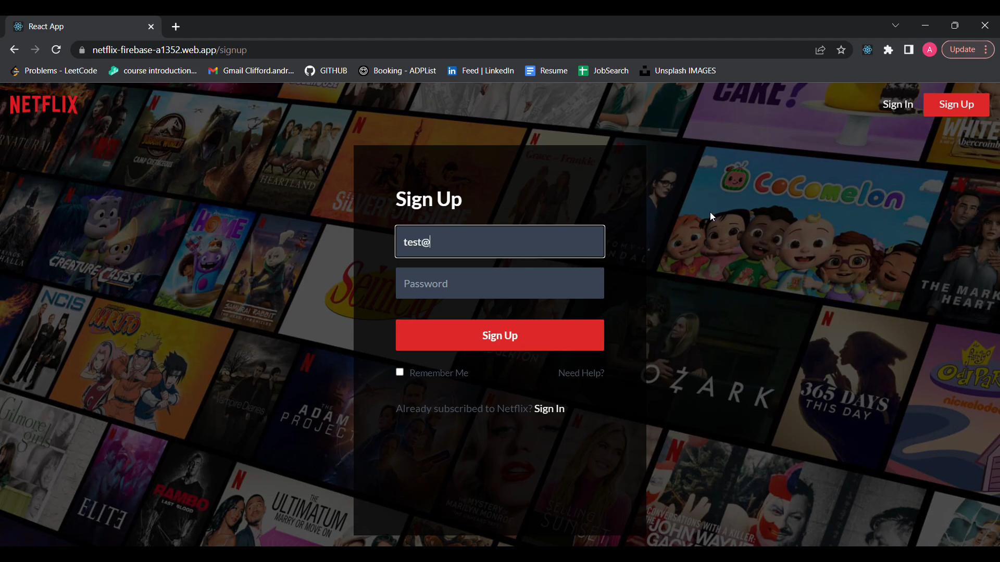
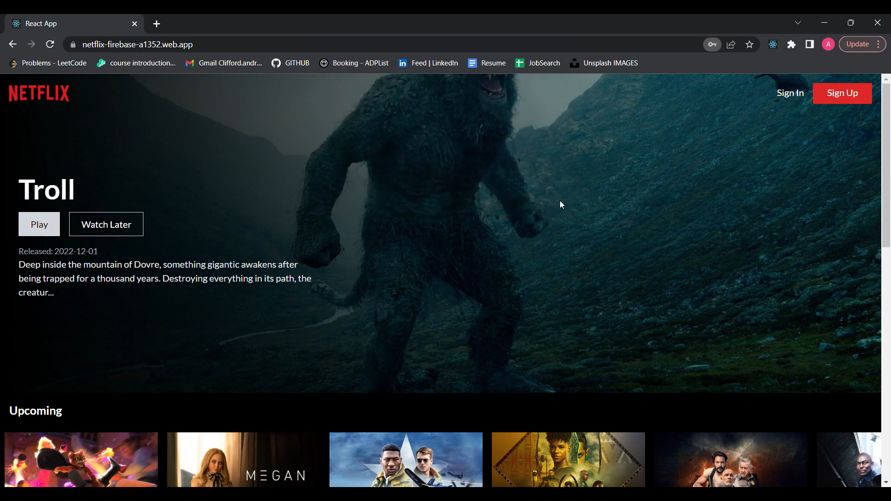

# Netflix Clone

## This React.js project was designed with the intent of creating a realistic UI clone of the popular Netflix platform, demonstrating my skills with front-end web design using tailwind CSS.

The app allows users to favorite and save their favorite films/shows for later on their account page. This rendered page displays information that is stored in the backend firestore database that I synced with the app. User accounts are authenticated for security with firebase. Axios is used to fetch data from the Movie Database, which renders the content we normally see on Netflix (movie titles, promo images, etc.)

* React.js and tailwind CSS used to efficiently generate a user-friendly, responsive website
* Firebase and firestore utilised to create a scalable back-end
* React Hooks like useState, useEffect and useNavigate deployed to manage state across the application, render pages and handle form inputs
* Created using functional components and react-router-dom to render different screens for users 
* Axios is used to fetch all of our data from the MovieDatabase API

## Watch the demo

## Visit the App

In the project directory, you can run:

### `npm start`

Runs the app in the development mode.\
Open [http://localhost:3000](http://localhost:3000) to view it in your browser.

The page will reload when you make changes.\
You may also see any lint errors in the console.

## Find a bug? 
feel free to contact me via email
